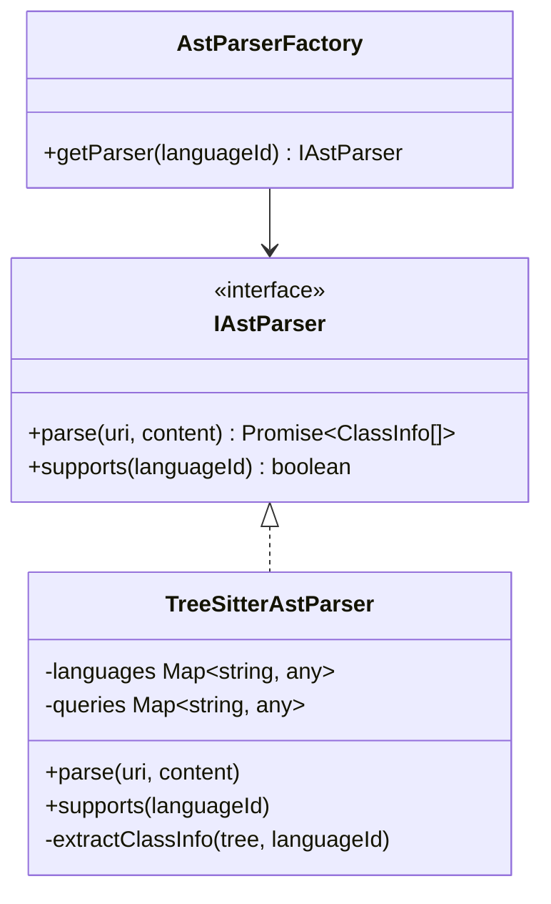

# 設計ドキュメント: tree-sitterを利用したdiagram.json構築

## 1. 概要
`node-tree-sitter` を使用して各種プログラミング言語のソースコードをパースし、クラス図のデータ構造（`ClassInfo` および最終的な `diagram.json`）を生成する仕組みを設計します。

## 2. アーキテクチャ

既存の `IAstParser` インターフェースを実装する `TreeSitterAstParser` を追加します。



## 3. コンポーネント設計

### 3.1. TreeSitterAstParser
- **役割**: `node-tree-sitter` を利用した汎用 AST 解析。
- **言語サポート**: 言語 ID に対応した `tree-sitter` 文法を動的にロードする。
- **クエリベースの抽出**: 各言語ごとに Tree-Sitter の `Query` (scm形式) を定義し、クラス、メソッド、属性を一貫した方法で抽出する。

### 3.2. 言語固有の設定 (Language Profiles)
各言語の解析に必要な情報を定義します。

| 言語 | 文法パッケージ | 主要なクエリ対象 |
| :--- | :--- | :--- |
| TypeScript | `tree-sitter-typescript` | `class_declaration`, `interface_declaration` |
| C# | `tree-sitter-c-sharp` | `class_declaration`, `interface_declaration`, `struct_declaration` |
| Java | `tree-sitter-java` | `class_declaration`, `interface_declaration` |

## 4. データフロー

1. `SourceToDiagramCommand` が実行される。
2. `AstParserFactory.getParser(languageId)` が呼び出される。
3. `TreeSitterAstParser` が選択される（既存のパーサーがない場合、または優先設定の場合）。
4. `TreeSitterAstParser.parse()` 内で：
    - 言語に対応する文法パッケージをロード。
    - Tree-Sitter で `Tree` を生成。
    - クエリを実行して、クラス定義、プロパティ、メソッドを抽出。
    - 抽出した情報を `ClassInfo` オブジェクトにマッピング。
5. `DiagramConverter` が `ClassInfo[]` を `diagram.json` 形式に変換。

## 5. 実装の詳細

### 5.1. 動的ロードの仕組み
`node-tree-sitter` および各言語の文法パッケージは、実行時に `require` または `import` で動的に読み込みます。インストールされていない場合は警告を表示し、その言語の解析をスキップします。

### 5.2. クエリ定義 (queries/*.scm)
言語ごとにクラス構造を抽出するためのクエリを用意します。
例 (abstract 構文):
```scm
(class_declaration
  name: (identifier) @class.name
  (class_body) @class.body) @class.def
```

## 6. 考慮事項

- **パフォーマンス**: 大規模ファイルでは Tree-Sitter のクエリ効率が重要になります。
- **依存関係**: `node-tree-sitter` はネイティブモジュールであるため、VS Code 拡張機能内でのバイナリ互換性に注意が必要です。
- **エラーハンドリング**: パースエラーが発生した際、Tree-Sitter は部分的な木を返すため、可能な限り情報を抽出するようにします。
