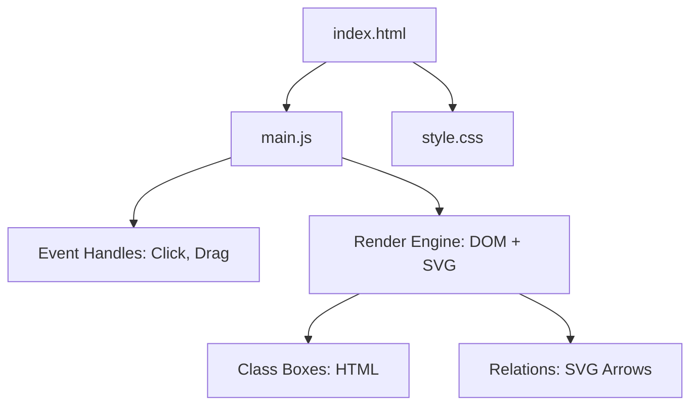

# Design Document - Class Diagram Editor

## Overview
VS Code Webview 上で UML ライクなクラス図を視覚的に編集するためのコンポーネント。HTML DOM によるノード表現と SVG によるリレーション表現を組み合わせたハイブリッド描画方式を採用します。

## Steering Document Alignment

### Technical Standards (tech.md)
- **Vanilla JS & CSS**: 外部ライブラリを最小限に抑え、パフォーマンスとカスタマイズ性を優先。
- **PostMessage API**: Extension Host との通信に標準 API を使用。

### Project Structure (structure.md)
- **`media/`**: Webview 用の静的リソース（HTML, CSS, JS）を配置。
- **Domain logic**: `main.js` 内に描画ロジックとイベントハンドラを定義。

## Code Reuse Analysis
- **`style.css`**: VS Code の CSS 変数 (`--vscode-editor-foreground` 等) を再利用。
- **`main.js`**: 既存の `lineRectIntersection` ロジックを継承。

## Architecture



### Modular Design Principles
- **DOM/SVG Separation**: ノードは操作性の高い HTML DOM、コネクタは柔軟な SVG で分離管理。
- **State-Driven Rendering**: `model` オブジェクトの変更を検知して `render()` を呼び出す構造。

## Components and Interfaces

### Render Engine (`render()`)
- **Purpose**: JSON モデルを視覚的な要素に変換。
- **Interfaces**: `render(model)`
- **Dependencies**: `drawRelations()`

### Relation Engine (`drawRelations()`)
- **Purpose**: ノード間の接続線を SVG で描画。
- **Interfaces**: `drawRelations(classes)`
- **Dependencies**: `lineRectIntersection()`

## Data Models

### Class Model
```typescript
interface Class {
  id: string; // cryptoRandomId
  name: string;
  x: number;
  y: number;
  width: number;
  height: number;
  attributes: Attribute[];
  operations: Operation[];
  baseClassId?: string;
}
```

## Error Handling
1. **Scenario 1: 循環参照の発生**
   - **Handling**: 継承関係のループを検知し、保存時に警告を出す。
   - **User Impact**: ユーザーに警告ダイアログを表示。

## Testing Strategy
- **Unit Testing**: `lineRectIntersection` の座標計算テスト。
- **Manual Verification**: VS Code 上でのドラッグ操作とリレーションの追従確認。
