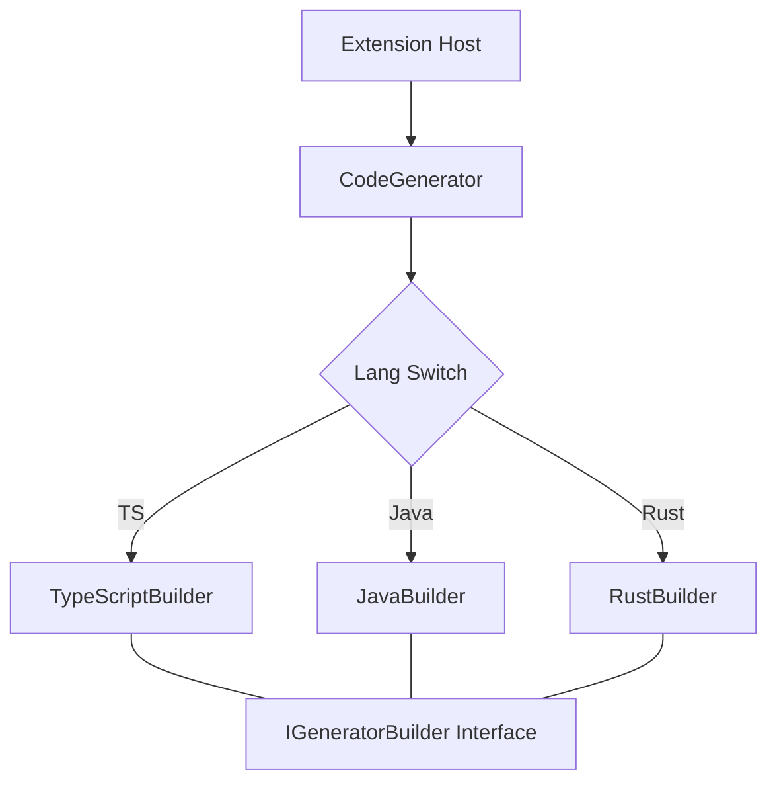

# Design Document - Code Generation Engine

## Overview
JSON 形式の IObjectModel を解析し、Builder パターンを用いて多言語のコードを生成するバックエンドモジュール。

## Steering Document Alignment

### Technical Standards (tech.md)
- **TypeScript**: 拡張機能のコアロジックを TypeScript で実装し、型安全性を確保。
- **Builder Pattern**: `IGeneratorBuilder` インターフェースによる拡張性の担保。

### Project Structure (structure.md)
- **`src/CodeComponents/`**: 各言語の Builder 実装を配置。

## Code Reuse Analysis
- **`CodeGenerator.ts`**: 全言語共通の生成フロー（フォルダ作成、ファイルループ、Builder 呼び出し）を統括。
- **`TypeModel.ts`**: 言語ごとの型変換マップを集中管理。

## Architecture



## Components and Interfaces

### `CodeGenerator` (`src/CodeComponents/CodeGenerator.ts`)
- **Purpose**: 生成プロセスのオーケストレーション。
- **Interfaces**: `generate(folder: Uri, model: IObjectModel)`
- **Dependencies**: `IGeneratorBuilder`, `vscode.workspace.fs`

### `TypeModel` (`src/CodeComponents/CodeGenerator.ts`)
- **Purpose**: 言語固有のプリミティブ型マッピングの提供。
- **Interfaces**: `getTypesForLang(lang: string)`

## Data Models

### Generator Options
```typescript
interface GeneratorOptions {
  language: string;
  outputDir: string;
  overwrite: boolean;
}
```

## Error Handling
1. **Scenario: サポート外言語の指定**
   - **Handling**: `generateCodeFiles` 内で例外をスロー。
   - **User Impact**: VS Code エラーメッセージとして表示。

## Testing Strategy
- **Unit Testing**: 
  - 言語ごとの Builder で生成される文字列の比較テスト。
  - `TypeModel` のマッピング検証。
