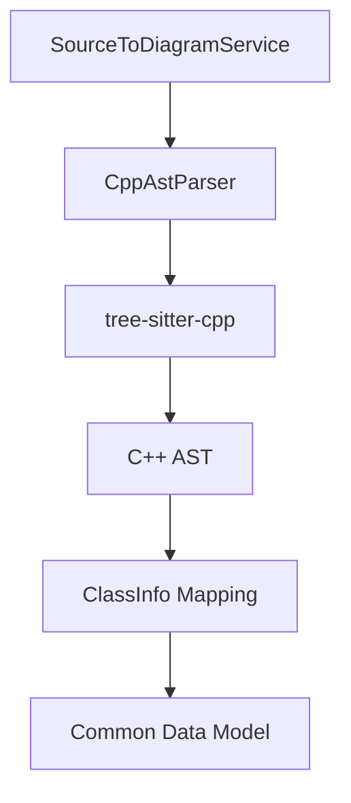

# 設計書: C++ ASTパーサー

## 概要

C++ ASTパーサーは、C++コードを解析してクラス図生成に必要なメタデータ（クラス、メンバ、継承関係など）を抽出するコンポーネントです。VS Code拡張機能内で動作し、`TypescriptAstParser`と同様に `IAstParser` インターフェースを実装します。

## Steering Document Alignment

### 技術基準 (tech.md)
- **TypeScript**: 拡張機能の主要言語としてTypeScriptを使用。
- **web-tree-sitter**: 堅牢で環境依存のないパースを実現するため、WASM版の `web-tree-sitter` と `tree-sitter-cpp.wasm` を使用。
- **非同期処理**: ファイル解析は非同期（`async/await`）で行い、UIスレッドをブロックしない。

### プロジェクト構造 (structure.md)
- `src/services/sourceToDiagram/ast/cpp/` ディレクトリに配置。
- `IAstParser.ts` で定義されたインターフェースを遵守。

## コード再利用分析

### 活用できる既存のコンポーネント
- **IAstParser**: 他の言語パーサーと共通のインターフェース。
- **types.ts**: `ClassInfo`, `OperationInfo`, `AttributeInfo` などの共有データモデル。
- **Logger**: `LoggerComponents/Logger` を使用して解析状況を記録。

### 統合ポイント
- **SourceToDiagramService**: 各言語のパーサーを管理し、適切なパーサーを呼び出すサービス。

## Architecture

`CppAstParser` は Tree-sitter を利用してC++の解析を行います。Tree-sitterは高速かつ堅牢な解析を提供し、不完全なコードでもASTを構築できる利点があります。



## コンポーネントとインターフェース

### CppAstParser
- **目的:** C++ソースコードを解析し、`ClassInfo` の配列を生成する。
- **インターフェース:** `IAstParser`
    - `supports(languageId: string): boolean`: 'cpp' をサポート。
    - `parse(uri: vscode.Uri, content: string): Promise<ClassInfo[]>`: 解析のメインエントリーポイント。
- **依存関係:** `vscode`, `web-tree-sitter`, `tree-sitter-cpp.wasm`
- **再利用:** `TypeScriptAstParser` の構造（ビジターパターン）を参考にする。

## データモデル

抽出結果は以下の共通モデルにマッピングされます：

### ClassInfo
```typescript
{
  name: string;
  kind: 'class' | 'abstract' | 'interface' | 'enum';
  baseClass?: string;
  interfaces: string[];
  attributes: AttributeInfo[];
  operations: OperationInfo[];
  location: { uri: vscode.Uri, range: vscode.Range };
}
```

## エラー処理

### エラーシナリオ
1. **Tree-sitterロード失敗:**
   - **取り扱い:** ログに警告を出力し、その言語の解析を無効化する。
   - **ユーザーの影響:** クラス図が生成されない（空の結果）。
2. **パースエラー（構文エラーのあるファイル）:**
   - **取り扱い:** Tree-sitterが提供するエラーノードを無視し、可能な限り健全なノードから情報を抽出する。
   - **ユーザーの影響:** 部分的なクラス図が表示される。

## テスト戦略

### 単体テスト
- モックした Tree-sitter AST に対して、正しく `ClassInfo` が抽出されるか検証。
- 基本的なクラス定義、継承、アクセス修飾子、メンバ関数のテスト。

### 統合テスト
- 実際にサンプルの `.cpp`, `.h` ファイルを読み込み、拡張機能全体としてクラス図が生成されるか検証。
