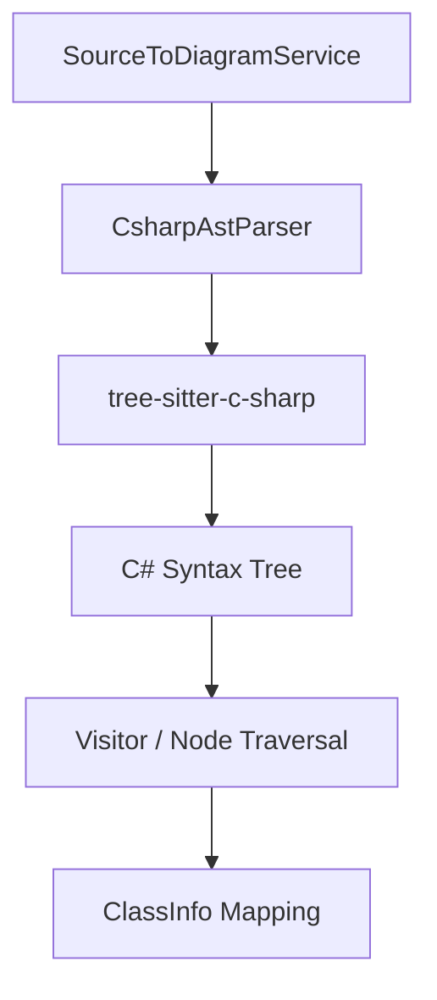

# 設計書: C# ASTパーサー

## 概要

C# ASTパーサーは、C# (.cs) ファイルを解析し、クラス、インターフェース、プロパティ、メソッドなどの構造情報を抽出するためのコンポーネントです。抽出された情報は、共通の `ClassInfo` モデルに変換され、クラス図の描画に使用されます。

## Steering Document Alignment

### 技術基準 (tech.md)
- **TypeScript**: 拡張機能のコードベースに合わせてTypeScriptで実装。
- **Parsing Strategy**: WASM版の `web-tree-sitter` と `tree-sitter-c-sharp.wasm` を使用。
- **Async API**: 他のパーサーと同様に、非同期処理を基本とします。

### プロジェクト構造 (structure.md)
- `src/services/sourceToDiagram/ast/csharp/` ディレクトリに配置。
- `IAstParser` インターフェースを実装。

## コード再利用分析

### 活用できる既存のコンポーネント
- **IAstParser.ts**: パーサーの共通インターフェース。
- **types.ts**: `ClassInfo` などの共通データ構造。
- **TypescriptAstParser.ts**: ビジターパターンの実装リファレンス。

### 統合ポイント
- **SourceToDiagramService**: 各言語のパーサーのロードと実行を管理。

## Architecture

C#パーサーは、Tree-sitterを用いて具象構文木（CST）を構築し、それを走査して必要な情報を抽出します。

## コンポーネントとインターフェース

### CsharpAstParser
- **目的:** C#ソースコードを `ClassInfo` の配列に変換する。
- **インターフェース:** `IAstParser`
    - `supports(languageId: string): boolean`: 'csharp' をサポート。
    - `parse(uri: vscode.Uri, content: string): Promise<ClassInfo[]>`: 解析処理の実行。
- **依存関係:** `web-tree-sitter`, `tree-sitter-c-sharp.wasm`, `vscode`

## データモデル

C#の構造を以下のように `ClassInfo` にマッピングします：
- `namespace`: `name` （完全修飾名の一部として扱うか、別途考慮）
- `class`, `interface`, `record`, `struct`: `kind`
- `property`: `AttributeInfo`
- `method`: `OperationInfo`

## エラー処理

### エラーシナリオ
1. **Tree-sitterのバインディングエラー:**
   - **取り扱い:** エラーをキャッチしてログ（Logger）に出力し、空の配列を返す。
   - **ユーザーの影響:** C#ファイルの解析が行われない。
2. **不完全なコードのパース:**
   - **取り扱い:** Tree-sitterの回復機能を利用し、認識可能な範囲で情報を抽出。

## テスト戦略

### 単体テスト
- 多様なC#構文（Auto-properties, Expression-bodied members, Primary constructorsなど）が正しく解析されることを検証。

### 統合テスト
- 実際の `.cs` ファイルを使用したエンドツーエンドの抽出テスト。
轉。
