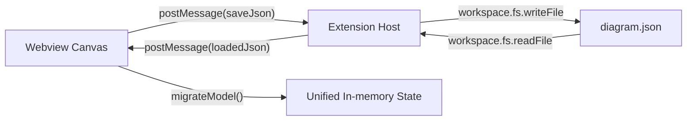

# Design Document - Data Persistence

## Overview
VS Code の FileSystem API を活用し、`diagram.json` への永続化と、Webview のメモリ上のモデルとの同期を行うレイヤー。

## Steering Document Alignment

### Technical Standards (tech.md)
- **JSON**: データ交換フォーマットとして標準的な JSON を採用。
- **VS Code API**: `workspace.fs` を通じてファイル操作を行うことで、リモート環境（Codespaces 等）にも対応。

### Project Structure (structure.md)
- **`src/extension.ts`**: 保存・読込のコマンド起点。
- **Webview side**: 保存データの整形とマイグレーションロジックの実行。

## Code Reuse Analysis
- **`cryptoRandomId`**: ID 生成に VS Code または Webview の標準 API を利用。

## Architecture



## Components and Interfaces

### Persistence Commands (`src/extension.ts`)
- **Purpose**: ファイルダイアログの表示とファイル I/O 実行。
- **Interfaces**: `saveJson`, `loadJson` メッセージハンドラ。

### Migration Utility (`media/main.js` 等)
- **Purpose**: バージョン間のデータ差分吸収。
- **Interfaces**: `migrateModel(data)`

## Data Models

### Root Schema
```json
{
  "classes": [
    {
      "id": "uuid",
      "name": "ClassName",
      "attributes": [],
      "operations": [
        { "name": "op", "workflow": { "nodes": [], "edges": [] } }
      ]
    }
  ]
}
```

## Error Handling
1. **Scenario: 保存ダイアログのキャンセル**
   - **Handling**: 書き込み処理を中断し、ステータスバーなどの通知は行わない（正常系）。
2. **Scenario: JSON パースエラー**
   - **Handling**: `try-catch` で捕捉し、具体的なエラー箇所を通知。

## Testing Strategy
- **Manual Verification**: 複雑な図面を保存し、一旦ファイルを閉じてから再度開いた時の整合性確認。
- **Regression Testing**: 古いバージョンの JSON データの読み込みテスト。
