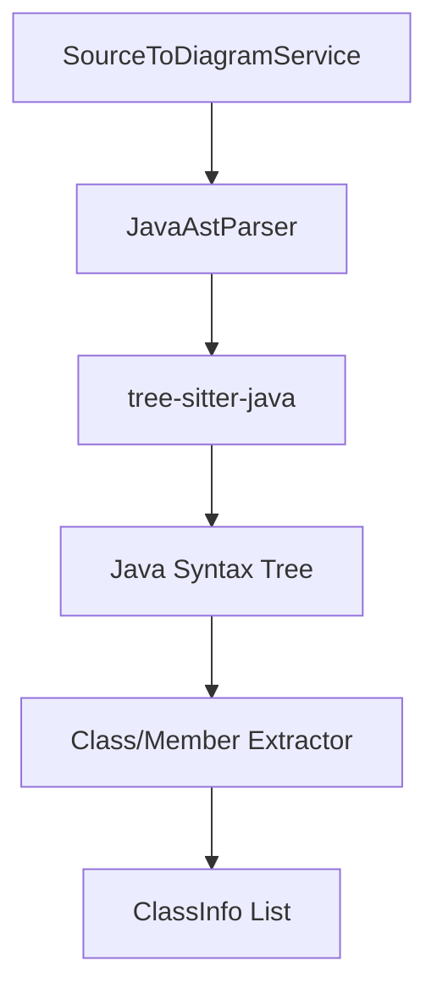

# 設計書: Java ASTパーサー

## 概要

Java ASTパーサーは、Javaソースコード（.java）からクラス、インターフェース、列挙型、レコード、およびそれぞれのメンバ情報を抽出するためのコンポーネントです。Tree-sitterを活用し、大規模プロジェクトでも高速に動作することを目指します。

## Steering Document Alignment

### 技術基準 (tech.md)
- **TypeScript**: 拡張機能のメイン言語として使用。
- **Library**: WASM版の `web-tree-sitter` と `tree-sitter-java.wasm` を採用。
- **Coding Standard**: シングルトンまたはDIを意識したサービス設計。

### プロジェクト構造 (structure.md)
- `src/services/sourceToDiagram/ast/java/` に配置。

## コード再利用分析

### 活用できる既存のコンポーネント
- **IAstParser**: すべてのパーサーが準拠すべきインターフェース。
- **TypescriptAstParser**: 実装構造のベース。

### 統合ポイント
- **SourceToDiagramService**: 各言語のパース機能を集約するポイント。

## Architecture

Javaパーサーは、Java固有の構文（アノテーション、ジェネリクス、内部クラスなど）を解釈し、正規化された `ClassInfo` 形式に変換します。

## コンポーネントとインターフェース

### JavaAstParser
- **目的:** Javaファイルを解析し、ダイアグラム用のメタデータを提供する。
- **インターフェース:** `IAstParser`
    - `supports(languageId: string)`: 'java' をサポート。
    - `parse(uri, content)`: 解析を実行。
- **依存関係:** `web-tree-sitter`, `tree-sitter-java.wasm`

## データモデル

- `package`: クラス名のプレフィックスまたは情報として保持。
- `class`, `interface`, `enum`, `record`: `ClassInfo.kind` にマッピング。
- `field`: `AttributeInfo` へ。
- `method`: `OperationInfo` へ（オーバーロードにも対応可能にする）。

## エラー処理

### エラーシナリオ
1. **ライブラリ未インストール/ロード失敗:**
   - **取り扱い:** ログに出力し、ユーザーにはその言語の解析が利用不可であることを通知（任意）。
2. **Java 21等の新構文への対応:**
   - **取り扱い:** Tree-sitterの更新状況に依存するが、パースエラー時は可能な限りスキップして継続。

## テスト戦略

### 単体テスト
- ジェネリクスを含むクラス、多重実装されたインターフェース、複雑なアノテーションを持つメンバの抽出テスト。

### 統合テスト
- Maven/Gradleプロジェクト内の標準的なJavaファイルを用いた抽出テスト。
