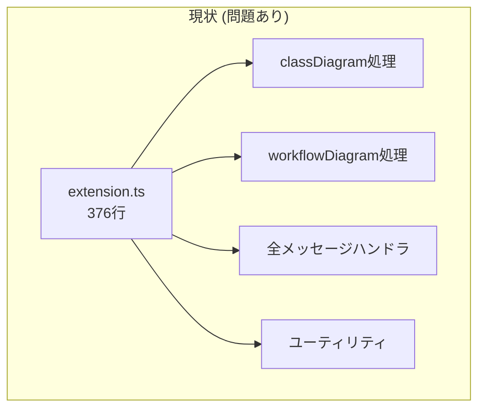
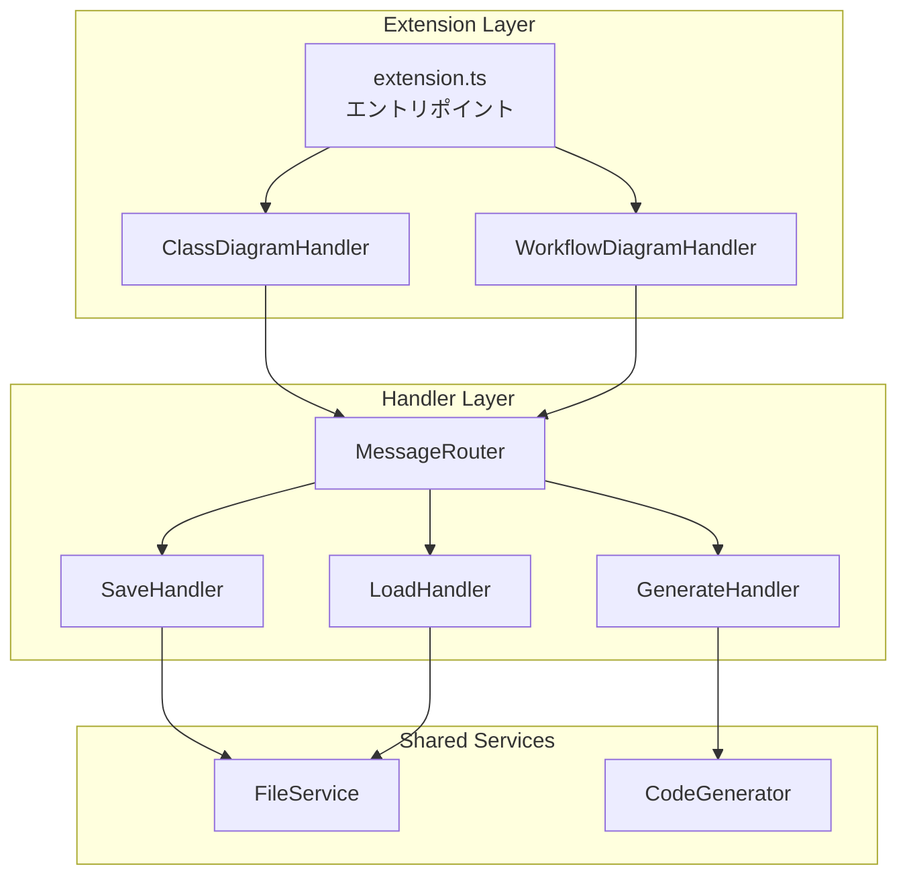
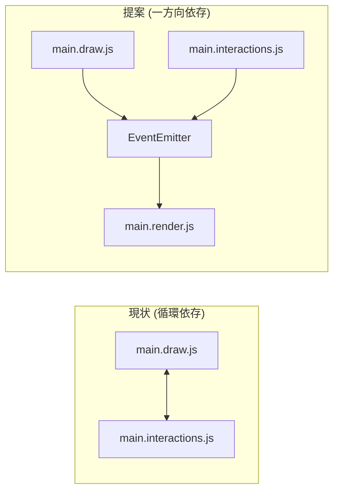

# 設計書 - プロジェクト問題点対策

## 概要

このドキュメントは、requirements.md で特定された8つの問題点に対する技術的な解決策を設計したものです。各問題に対してアーキテクチャ改善、コードリファクタリング、およびベストプラクティスの導入を提案します。

## Steering Document Alignment

### 技術基準 (tech.md)
- **TypeScript 準拠**: Extension 側の型安全性を強化
- **Vanilla JS 維持**: Webview は引き続き軽量な Vanilla JS を使用（ただし JSDoc による型アノテーション強化）
- **CommonJS 形式**: 現在の `package.json` の設定を維持

### プロジェクト構造 (structure.md)
- `src/` 配下に新しいモジュール分割を導入
- `media/` 配下の責務分離を明確化

## コード再利用分析

### 活用できる既存のコンポーネント
- **CodeGenerator パターン**: Builder パターンの既存実装を参考
- **Logger**: 既存のロガーコンポーネントを活用
- **main.state.js**: 状態管理の中央集権化モデルを拡張

### 統合ポイント
- **Webview メッセージング**: 既存の `postMessage` API を維持
- **VS Code API**: 既存のコマンドとパネル管理を継続

---

## Architecture

### 現状の問題構造



### 提案アーキテクチャ



---

## コンポーネントとインターフェース

### 問題1対策: Extension モジュール分割

#### Component: ClassDiagramHandler
- **目的:** classDiagram パネルの作成とライフサイクル管理
- **インターフェース:**
  ```typescript
  interface IClassDiagramHandler {
    create(context: vscode.ExtensionContext): vscode.WebviewPanel;
    dispose(): void;
  }
  ```
- **依存関係:** MessageRouter, FileService, CodeGenerator
- **配置:** `src/handlers/ClassDiagramHandler.ts`

#### Component: WorkflowDiagramHandler
- **目的:** workflowDiagram パネルの作成とライフサイクル管理
- **インターフェース:** IClassDiagramHandler と同様
- **配置:** `src/handlers/WorkflowDiagramHandler.ts`

#### Component: MessageRouter
- **目的:** Webview からのメッセージを適切なハンドラにルーティング
- **インターフェース:**
  ```typescript
  interface IMessageRouter {
    register(command: string, handler: MessageHandler): void;
    dispatch(message: WebviewMessage): Promise<void>;
  }
  ```
- **配置:** `src/messaging/MessageRouter.ts`

---

### 問題2対策: 共通サービス抽出

#### Component: FileService
- **目的:** ファイルの読み込み・保存の共通処理
- **インターフェース:**
  ```typescript
  interface IFileService {
    loadJson(defaultPath?: string): Promise<{uri: vscode.Uri, content: object} | null>;
    saveJson(content: object, defaultPath?: string): Promise<vscode.Uri | null>;
    findWorkspaceDiagram(): Promise<object | null>;
  }
  ```
- **配置:** `src/services/FileService.ts`

---

### 問題3対策: Webview 型安全性強化

#### 型定義ファイル
- **配置:** `media/types.d.ts`
- **内容:**
  ```typescript
  /** モデルの型定義 */
  interface ClassModel {
    id: string;
    name: string;
    x: number;
    y: number;
    width: number;
    height: number;
    baseClassId: string | null;
    interfaces: string[];
    isAbstract: boolean;
    isInterface: boolean;
    isStruct: boolean;
    attributes: Attribute[];
    operations: Operation[];
  }
  
  interface DiagramModel {
    classes: ClassModel[];
  }
  ```

#### JSDoc 強化規約
- すべての export 関数に `@param` と `@returns` を追加
- 複雑なオブジェクトには `@typedef` を使用

---

### 問題4対策: パフォーマンス最適化

#### デバウンス付き render
```javascript
// main.draw.js に追加
let renderDebounceTimer = null;
export function requestRender() {
    if (renderDebounceTimer) clearTimeout(renderDebounceTimer);
    renderDebounceTimer = setTimeout(render, 16); // ~60fps
}
```

#### バッチ更新パターン
- 複数の変更を1フレームにまとめて適用
- `requestAnimationFrame` の活用

---

### 問題5対策: エラーハンドリング強化

#### エラーシナリオ
1. **JSON パースエラー**
   - **取り扱い:** try-catch でキャッチし、ユーザーに明確なエラーメッセージを表示
   - **ユーザーの影響:** 「無効なJSONファイルです。ファイル形式を確認してください。」

2. **DOM 要素が見つからない**
   - **取り扱い:** null チェックを追加し、早期リターン
   - **ユーザーの影響:** サイレントエラー（コンソールにログ）

3. **ファイル I/O エラー**
   - **取り扱い:** VS Code のエラーダイアログで通知
   - **ユーザーの影響:** 「ファイルの保存に失敗しました: [詳細]」

---

### 問題6対策: 循環依存解消



#### Component: EventEmitter
- **目的:** モジュール間の疎結合な通信
- **インターフェース:**
  ```javascript
  // main.events.js
  export const events = {
    on(event, callback) { ... },
    emit(event, data) { ... },
    off(event, callback) { ... }
  };
  ```
- **配置:** `media/main.events.js`

---

### 問題7対策: テスト戦略

#### 単体テスト
- `src/test/unit/` に追加
- `main.utils.js` の関数をテスト可能な形式に

#### 統合テスト
- `src/test/integration/` に追加
- メッセージング往復のテスト

#### E2E テスト（将来）
- Webview 操作の自動化テスト

---

### 問題8対策: SVG サイズ調整改善

```javascript
function adjustSvgSize() {
    const container = dom.container;
    const svg = dom.svg;
    
    if (!container || !svg) {
        console.warn('Container or SVG not found');
        return;
    }
    
    // コンテンツの実際の範囲を計算
    const boxes = container.querySelectorAll('.classbox');
    let maxRight = container.clientWidth;
    let maxBottom = container.clientHeight;
    
    boxes.forEach(box => {
        const rect = box.getBoundingClientRect();
        const containerRect = container.getBoundingClientRect();
        const right = (rect.right - containerRect.left) + container.scrollLeft + 50;
        const bottom = (rect.bottom - containerRect.top) + container.scrollTop + 50;
        maxRight = Math.max(maxRight, right);
        maxBottom = Math.max(maxBottom, bottom);
    });
    
    svg.style.width = `${maxRight}px`;
    svg.style.height = `${maxBottom}px`;
}
```

---

## データモデル

### WebviewMessage
```typescript
interface WebviewMessage {
    command: string;
    payload?: any;
    language?: string;
    text?: string;
}
```

### DiagramModel
```typescript
interface DiagramModel {
    classes: ClassModel[];
    version?: string; // 将来のマイグレーション用
}
```

---

## テスト戦略

### 単体テスト
- **対象:** `FileService`, `MessageRouter`, `main.utils.js`
- **ツール:** 既存の `@vscode/test-cli`
- **実行:** `npm run test`

### 統合テスト
- **対象:** Extension のコマンド登録、Webview 作成
- **実行:** `npm run test`

### 手動テスト
- **クラス図操作:** クラスの追加・削除・ドラッグ
- **コード生成:** 各言語での生成確認
- **スクロール動作:** 大量のクラスでのSVG表示確認
