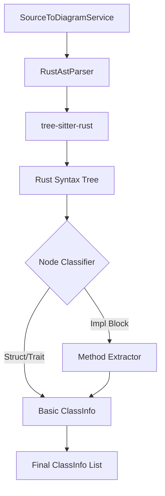

# 設計書: Rust ASTパーサー

## 概要

Rust ASTパーサーは、Rustソースコード（.rs）を解析し、構造体、トレイト、およびそれらの実装（impl）情報を抽出します。Rust特有の「データと振る舞いの分離」を、クラス図の「クラスとメソッド」の概念に適切にマッピングします。

## Steering Document Alignment

### 技術基準 (tech.md)
- **TypeScript**: 拡張機能の共通言語。
- **Library**: WASM版の `web-tree-sitter` と `tree-sitter-rust.wasm` を使用。
- **Modern Features**: Rustの `enum` (ADTs) やジェネリクス、アソシエイトタイプ等のパースも考慮。

### プロジェクト構造 (structure.md)
- `src/services/sourceToDiagram/ast/rust/` に配置。

## コード再利用分析

### 活用できる既存のコンポーネント
- **IAstParser**: インターフェース定義。
- **TypescriptAstParser**: 先行事例としての実装パターン。

### 統合ポイント
- **SourceToDiagramService**: Rustパーサーの統合先。

## Architecture

Rustパーサーは、同一ファイル内の `struct` 定義とそれに対応する `impl` ブロックを紐づけるロジックを持ちます。

## コンポーネントとインターフェース

### RustAstParser
- **目的:** Rustコードから構造詳細を抽出し、ダイアグラム用データに変換する。
- **インターフェース:** `IAstParser`
    - `supports(languageId: string)`: 'rust' をサポート。
    - `parse(uri, content)`: 解析を実行。
- **依存関係:** `web-tree-sitter`, `tree-sitter-rust.wasm`

## データモデルのマッピング

- `struct`: `ClassInfo (kind: 'class')`
- `trait`: `ClassInfo (kind: 'interface')`
- `enum`: `ClassInfo (kind: 'enum')`
- `impl Struct`: 内包する関数をその `Struct` の `operations` に追加。
- `impl Trait for Struct`: `Struct` の `interfaces` に `Trait` を追加。

## エラー処理

### エラーシナリオ
1. **マクロ展開:**
   - **取り扱い:** Tree-sitterはマクロ内部を完全にはパースできない場合がある。その場合、マクロ呼び出し自体を検出し、可能なら単純なメタデータとして扱う。
2. **モジュール分割:**
   - **取り扱い:** 現在のスコープは単一ファイル。別ファイルの `impl` 等は今後の課題。

## テスト戦略

### 単体テスト
- `impl` ブロックが離れた場所にある場合のメソッド抽出、トレイトの実装関係抽出のテスト。

### 統合テスト
- 標準的な `main.rs` やライブラリコードを用いたテスト。
轉。
