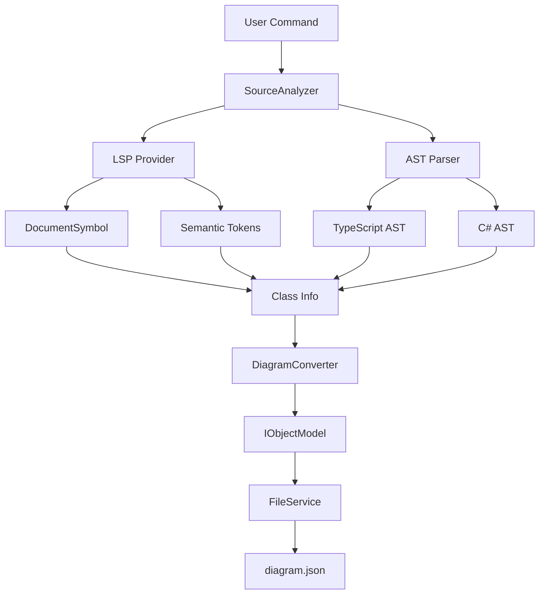

# 設計書 - ソースコードからdiagram.json構築

## 概要

本機能は、既存のソースコードを解析してdiagram.json形式のクラス図データを自動生成する機能です。Language Server Protocol（LSP）のDocumentSymbol、Semantic Tokens、および言語固有のASTパーサーを組み合わせて、高精度なクラス構造の抽出を実現します。

この機能は、既存のクラス図エディタ（ClassDiagramHandler）と統合され、リバースエンジニアリングのワークフローを完成させます。

## Steering Document Alignment

### 技術基準 (tech.md)

- **VS Code API**: VS Codeの標準的なLSPプロバイダー（TypeScript、C#等）を活用し、拡張機能ホストプロセス内で動作する
- **TypeScript**: Extension側はTypeScript（CommonJS）で実装し、既存のコードベースと一貫性を保つ
- **モジュール設計**: 各機能（LSP連携、AST解析、変換）を独立したモジュールとして実装し、単一責任原則に従う
- **依存管理**: LSPプロバイダーはオプショナルとし、利用できない場合はASTパーサーにフォールバックする

### プロジェクト構造 (structure.md)

- **Module Responsibilities**: 
  - `src/services/`: 新しいサービス層としてソースコード解析機能を配置
  - `src/services/lsp/`: LSPプロバイダー連携モジュール
  - `src/services/ast/`: AST解析モジュール（言語別サブモジュール）
  - `src/services/converter/`: diagram.json変換モジュール
- **Extension Host**: `src/extension.ts`に新しいコマンドを登録し、既存のHandlerパターンと統合
- **既存コンポーネントの活用**: `FileService`、`Logger`、`IObjectModel`インターフェースを再利用

## コード再利用分析

### 活用できる既存のコンポーネント

- **`FileService`**: diagram.jsonの保存・読み込み処理を再利用。新機能では生成されたdiagram.jsonの保存に使用
- **`Logger`**: 解析プロセス中のログ出力とエラー記録に使用
- **`IObjectModel`、`IClassModel`、`IAttributeModel`、`IOperationModel`**: 既存のデータモデルインターフェースをそのまま使用し、変換結果の型安全性を保証
- **`TypeModel`**: 型名のマッピングロジックを再利用（必要に応じて）
- **コマンド登録パターン**: `src/extension.ts`の既存パターンに従い、新しいコマンドを登録

### 統合ポイント

- **`ClassDiagramHandler`**: 生成されたdiagram.jsonを読み込んでクラス図エディタに表示する機能を追加（既存の`handleLoadJson`を活用）
- **`src/extension.ts`**: 新しいコマンド`sourceToDiagram.generate`を登録し、統合エントリーポイントを提供
- **VS Code LSP API**: `vscode.languages.*`名前空間のAPIを使用してLSPプロバイダーにアクセス

## Architecture

本機能は、3層のアーキテクチャで構成されます：

1. **エントリーポイント層**: コマンドハンドラーとユーザーインターフェース
2. **解析層**: LSP連携とAST解析の統合
3. **変換層**: 抽出された情報をdiagram.json形式に変換

### モジュラー設計の原則

- **単一ファイル責任**: 各モジュールは明確な責務を持つ（LSP連携、AST解析、変換）
- **コンポーネントの分離**: 言語固有のパーサーは独立したモジュールとして実装
- **サービス層の分離**: 解析ロジックと変換ロジックを明確に分離
- **インターフェース駆動**: 各層はインターフェースを通じて通信し、実装の交換可能性を確保



## コンポーネントとインターフェース

### SourceAnalyzer (`src/services/SourceAnalyzer.ts`)

- **目的:** ソースコード解析の統合エントリーポイント。LSPとAST解析を組み合わせてクラス情報を抽出する
- **インターフェース:** 
  ```typescript
  interface ISourceAnalyzer {
      analyzeFile(uri: vscode.Uri): Promise<ClassInfo[]>;
      analyzeWorkspace(options?: AnalyzeOptions): Promise<ClassInfo[]>;
  }
  ```
- **依存関係:** `ILspProvider`、`IAstParser`、`Logger`
- **再利用:** `FileService`を使用してファイルを読み込む

### LspProvider (`src/services/lsp/LspProvider.ts`)

- **目的:** VS CodeのLSPプロバイダーにアクセスし、DocumentSymbolとSemantic Tokensを取得する
- **インターフェース:**
  ```typescript
  interface ILspProvider {
      getDocumentSymbols(uri: vscode.Uri): Promise<vscode.DocumentSymbol[]>;
      getSemanticTokens(uri: vscode.Uri): Promise<vscode.SemanticTokens | null>;
      isAvailable(languageId: string): boolean;
  }
  ```
- **依存関係:** VS Code API (`vscode.languages.*`)
- **再利用:** VS Codeの標準LSPプロバイダーを利用

### TypeScriptAstParser (`src/services/ast/typescript/TypescriptAstParser.ts`)

- **目的:** TypeScript/JavaScriptファイルをAST解析してクラス構造を抽出する
- **インターフェース:**
  ```typescript
  interface IAstParser {
      parse(uri: vscode.Uri, content: string): Promise<ClassInfo[]>;
      supports(languageId: string): boolean;
  }
  ```
- **依存関係:** `@typescript-eslint/parser`（オプショナル、動的ロード）
- **再利用:** 既存の`TypeModel`を型名マッピングに使用

### CSharpAstParser (`src/services/ast/csharp/CSharpAstParser.ts`)

- **目的:** C#ファイルをAST解析してクラス構造を抽出する（LSPが利用できない場合のフォールバック）
- **インターフェース:** `IAstParser`を実装
- **依存関係:** C#用のASTパーサー（例：`roslyn`、または簡易的な正規表現ベースのパーサー）
- **再利用:** 共通の`IAstParser`インターフェースを通じて統合

### DiagramConverter (`src/services/converter/DiagramConverter.ts`)

- **目的:** 抽出されたクラス情報（`ClassInfo`）を`IObjectModel`形式に変換する
- **インターフェース:**
  ```typescript
  interface IDiagramConverter {
      convert(classes: ClassInfo[]): IObjectModel;
      generateLayout(classes: ClassInfo[]): LayoutInfo;
  }
  ```
- **依存関係:** `IObjectModel`、`IClassModel`等の既存インターフェース
- **再利用:** 既存のデータモデルインターフェースをそのまま使用

### SourceToDiagramCommand (`src/commands/SourceToDiagramCommand.ts`)

- **目的:** ユーザーコマンドのエントリーポイント。ファイル選択、解析実行、結果保存を統合
- **インターフェース:** VS Codeコマンドハンドラー（`() => Promise<void>`）
- **依存関係:** `SourceAnalyzer`、`DiagramConverter`、`FileService`、`Logger`
- **再利用:** 既存のコマンド登録パターンに従う

## データモデル

### ClassInfo（中間データ構造）

解析層から変換層へのデータ受け渡しに使用する中間形式：

```typescript
interface ClassInfo {
    name: string;
    kind: 'class' | 'interface' | 'abstract' | 'struct';
    baseClass?: string;
    interfaces: string[];
    genericParameters?: string[];
    location: {
        uri: vscode.Uri;
        range: vscode.Range;
    };
    attributes: AttributeInfo[];
    operations: OperationInfo[];
}

interface AttributeInfo {
    name: string;
    type: string;
    visibility: 'public' | 'private' | 'protected' | 'internal';
    modifiers: string[]; // 'static', 'readonly', etc.
    isAbstract?: boolean;
    location: vscode.Range;
}

interface OperationInfo {
    name: string;
    returnType: string;
    parameters: ParameterInfo[];
    visibility: 'public' | 'private' | 'protected' | 'internal';
    modifiers: string[]; // 'static', 'abstract', 'virtual', etc.
    location: vscode.Range;
}

interface ParameterInfo {
    name: string;
    type: string;
    isOptional?: boolean;
    defaultValue?: string;
}
```

### LayoutInfo（レイアウト情報）

自動レイアウト生成用の情報：

```typescript
interface LayoutInfo {
    classId: string;
    x: number;
    y: number;
    width: number;
    height: number;
}
```

### AnalyzeOptions（解析オプション）

```typescript
interface AnalyzeOptions {
    includePatterns?: string[]; // 例: ['**/*.ts', '**/*.cs']
    excludePatterns?: string[]; // 例: ['**/node_modules/**', '**/out/**']
    useLsp?: boolean; // LSPを使用するか（デフォルト: true）
    useAst?: boolean; // ASTを使用するか（デフォルト: true）
    maxFiles?: number; // 最大ファイル数（パフォーマンス制限）
}
```

## エラー処理

### エラーシナリオ

1. **Scenario 1: LSPプロバイダーが利用できない**
   - **取り扱い:** ASTパーサーにフォールバック。両方とも利用できない場合はエラーメッセージを表示
   - **ユーザーの影響:** 警告メッセージを表示しつつ、可能な限り解析を続行

2. **Scenario 2: 構文エラーがあるファイル**
   - **取り扱い:** エラーをログに記録し、解析可能な部分のみを抽出。エラーがあるファイルはスキップせず、部分的な結果を返す
   - **ユーザーの影響:** ログにエラー情報を出力し、成功した部分のみでdiagram.jsonを生成

3. **Scenario 3: 大規模プロジェクト（500ファイル以上）**
   - **取り扱い:** プログレスバーを表示し、バックグラウンドで処理。ユーザーにキャンセルオプションを提供
   - **ユーザーの影響:** 進行状況を可視化し、必要に応じて処理を中断可能

4. **Scenario 4: メモリ不足**
   - **取り扱い:** ファイルをバッチ処理し、一度に処理するファイル数を制限
   - **ユーザーの影響:** 処理が遅くなる可能性があるが、メモリエラーを回避

5. **Scenario 5: 言語固有のパーサーがインストールされていない**
   - **取り扱い:** LSPプロバイダーのみを使用するか、ユーザーにパーサーのインストールを促す
   - **ユーザーの影響:** 機能が制限される可能性があるが、基本的な解析は継続

## テスト戦略

### 単体テスト

- **LspProvider**: 
  - MockされたVS Code APIを使用してDocumentSymbolとSemantic Tokensの取得をテスト
  - LSPプロバイダーが利用できない場合のフォールバック動作をテスト
- **AstParser（各言語）**: 
  - サンプルソースコードを入力として、期待される`ClassInfo`が抽出されることを検証
  - 構文エラーがあるコードでの部分的な解析をテスト
- **DiagramConverter**: 
  - `ClassInfo[]`を入力として、正しい`IObjectModel`が生成されることを検証
  - 継承関係、インターフェース実装が正しく変換されることをテスト

### 統合テスト

- **SourceAnalyzer**: 
  - 実際のTypeScriptファイルを使用して、LSPとAST解析の統合をテスト
  - 複数ファイルのワークスペース解析をテスト
- **SourceToDiagramCommand**: 
  - エンドツーエンドのフロー（コマンド実行→解析→保存）をテスト
  - エラーハンドリングとユーザーフィードバックをテスト

### End-to-End テスト

- **VS Code Extension Testing Framework**: 
  - 実際のVS Code環境でコマンドを実行し、diagram.jsonが正しく生成されることを検証
  - 生成されたdiagram.jsonをクラス図エディタで読み込んで表示できることを確認
- **マルチ言語対応**: 
  - TypeScript、C#、Java等の各言語で実際のソースコードからdiagram.jsonを生成し、正確性を検証

