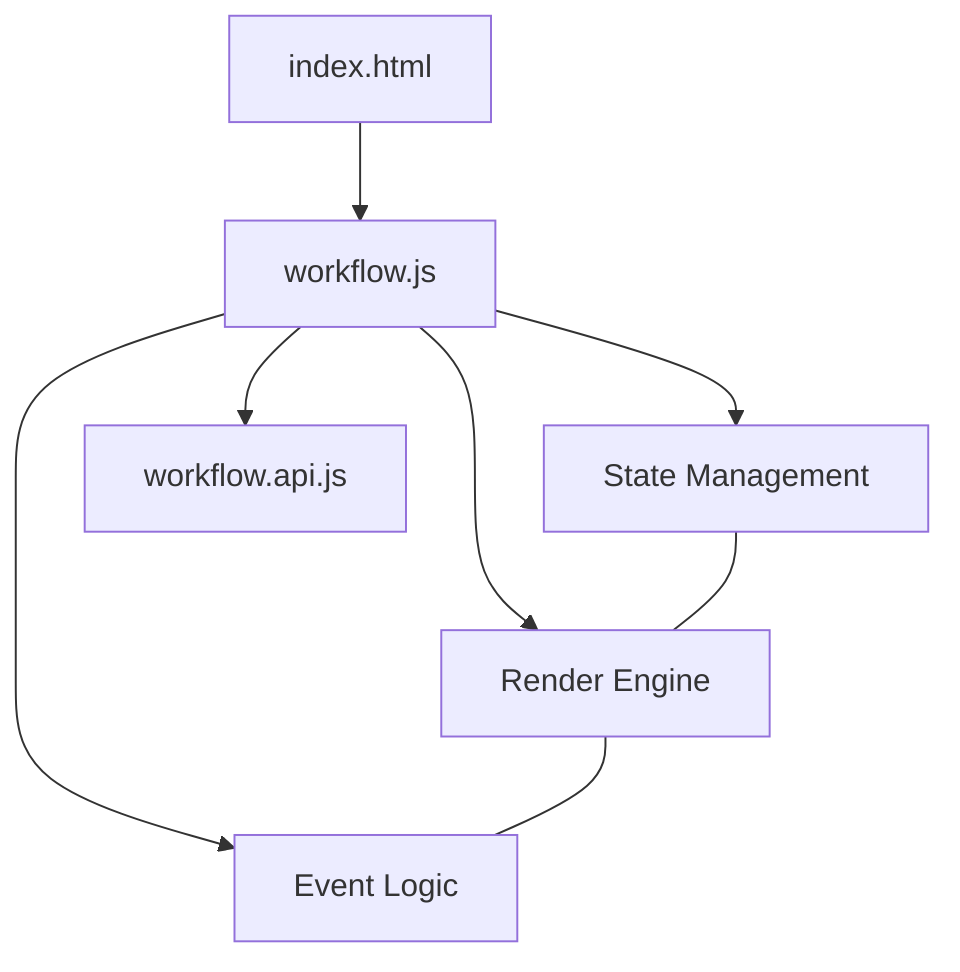

# Design Document - Workflow Editor

## Overview
クラス図エディタから特定の操作（Operation）を選択した際に起動する、メソッド内部ロジック編集用Webviewコンポーネント。ES Modules による詳細なモジュール分割を採用し、メンテナンス性を高めます。

## Steering Document Alignment

### Technical Standards (tech.md)
- **ES Modules**: `workflow.*.js` 形式でファイルを分割し、モジュール間の依存関係を明示。
- **SVG Canvas**: 複雑なパス描画に対応するため、全面 SVG による描画を採用。

### Project Structure (structure.md)
- **`media.workflow/`**: ワークフロー専用のディレクトリとして独立。

## Code Reuse Analysis
- **`workflow.utils.js`**: `getSvgPoint` 等の汎用座標計算ロジックをクラス図エディタと（必要に応じて）共有可能。

## Architecture



## Components and Interfaces

### State Manager (`workflow.state.js`)
- **Purpose**: 図面の状態（ノード、エッジ）を一元管理。
- **Interfaces**: `setWorkflow(wf)`, `state` オブジェクト。

### Interaction Manager (`workflow.interactions.js`)
- **Purpose**: ドラッグ、接続、コンテキストメニュー等の入力を処理。
- **Interfaces**: `initInteractions(params)`

## Data Models

### Workflow Model
```typescript
interface Workflow {
  nodes: WorkflowNode[];
  edges: WorkflowEdge[];
}

interface WorkflowNode {
  id: string;
  type: 'start' | 'end' | 'process' | 'decision';
  label: string;
  x: number;
  y: number;
}

interface WorkflowEdge {
  from: string; // Node ID
  to: string;   // Node ID
  mid?: { x: number, y: number };
  condition?: string;
}
```

## Testing Strategy
- **Unit Testing**: 状態遷移 (`workflow.state.js`) の単体テスト。
- **Manual Verification**: ノード生成からエッジの曲げ、保存までの一連のフロー確認。
