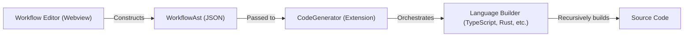

# Design Document - Workflow Node Conversion

## Overview
ワークフロー図エディタが生成した論理構造を、各言語ビルダーが効率的にソースコードへ変換するための仕組みを設計します。
エディタ側でグラフ構造（Nodes/Edges）から木構造（AST）への変換（または最初から木構造としての管理）を行い、ビルダー側は再帰的な処理でコードを生成する構成をとります。

## Steering Document Alignment

### Technical Standards (tech.md)
- **Workflow Conversion**: `TypeModel`（本ドキュメントでは `WorkflowAst` と呼称）を用いた責務の分離を実現します。
- **Separation of Concerns**: エディタが AST を提供し、`CodeBuilder` のサブクラスがその AST を消費して言語固有のコードを生成します。

### Project Structure (structure.md)
- **Module Responsibilities**: Frontend が `WorkflowAst` を構築し、Backend (`src/CodeComponents/`) が変換を担う構造に従います。

## Architecture

ワークフローの変換フローは以下の通りです。



## Data Models

### WorkflowAst
言語中立な抽象構文木。

```typescript
export interface WorkflowAst {
    variables: IVariableModel[];
    body: WfAstNode[];
}

export interface IVariableModel {
    name: string;
    type: string;
    initialValue?: string;
}

export type WfAstNode = 
    | IActionNode 
    | IIfNode 
    | IWhileNode 
    | IReturnNode 
    | ISequenceNode;

export interface IActionNode {
    type: 'action';
    statement: string; // 例: "count = count + 1"
}

export interface IIfNode {
    type: 'if';
    condition: string;
    then: WfAstNode[];
    else?: WfAstNode[];
}

export interface IWhileNode {
    type: 'while';
    condition: string;
    body: WfAstNode[];
}

export interface IReturnNode {
    type: 'return';
    value?: string;
}

export interface ISequenceNode {
    type: 'sequence';
    nodes: WfAstNode[];
}
```

## Integrated Interfaces

### IGeneratorBuilder (Extension)
ワークフロー変換用のメソッドを追加します。

- **`generateWorkflow(ast: WorkflowAst): string[]`**: ワークフロー全体をコード化し、行ごとの文字列配列を返します。
- **`buildWfNode(node: WfAstNode, indent: number): string[]`**: 各ノードを再帰的に定義するための内部メソッド（またはビルダー内の共通ロジック）。

## Components and Interfaces

### Workflow Editor (Frontend)
- **Purpose:** ユーザーが配置したノードとエッジを解析し、`WorkflowAst` を構築する。
- **Output:** `WorkflowAst` オブジェクト。

### CodeBuilder (Backend Base Class)
- **Purpose:** 各言語共通のワークフロー処理ロジック（再帰的なノード巡回など）を提供する。
- **Strategy:** 
  - `if`, `while` などのキーワードや波括弧の有無など、言語ごとの「ガワ」の部分をサブクラスが定義するテンプレートメソッドパターンを採用する。

## Error Handling

### Error Scenarios
1. **循環参照:** エディタ側で AST を構築する際、不正なループが検出された場合。
   - **Handling:** エディタ側でバリデーションを行い、保存を禁止する。
2. **未定義変数の参照:** `WorkflowAst.variables` にない変数が `statement` 内で使用されている。
   - **Handling:** ビルダー側はそのまま出力するが、必要に応じて警告情報を付加する。

## Testing Strategy

### Unit Testing
- **Builder Mock Test:** 静的な `WorkflowAst` の JSON を各言語ビルダーに入力し、期待されるソースコード文字列が出力されることを検証する。
- **Node-to-AST Test:** エディタ側のロジック（が将来的に実装される際）において、特定のノード配置から正しい AST が生成されるかを検証する。

### Integration Testing
- ワークフロー図を保存し、実際に `.ts` や `.rs` ファイルが生成され、構文エラーがないことを確認する。
