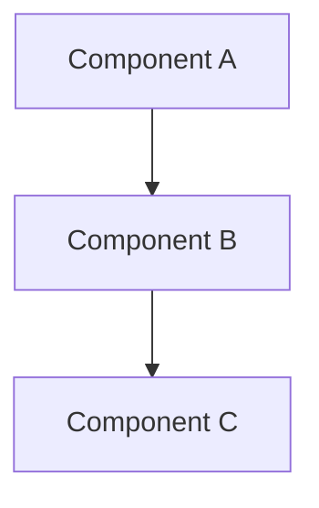

# 設計書

## 概要

[機能の概要と、それがシステム全体の中でどのような位置を占めるか]

## Steering Document Alignment

### 技術基準 (tech.md)
[設計が文書化された技術パターンと標準にどのように従っているか]

### プロジェクト構造 (structure.md)
[実装がプロジェクト組織の慣例にどのように従うか]

## コード再利用分析
[この機能で活用、拡張、統合される既存のコードは何か]

### 活用できる既存のコンポーネント
- **[コンポーネント/ユーティリティ名]**: [どのように活用するか]
- **[サービス/ヘルパー名]**: [どのように拡張するか]

### 統合ポイント
- **[既存のシステム/API]**: [新しい機能がどのように統合されるか]
- **[データベース/ストレージ]**: [データが既存のスキーマに接続する方法]

## Architecture

[使用されている全体的なアーキテクチャと設計パターンについて説明します]

### モジュラー設計の原則
- **単一ファイル責任**: 各ファイルは1つの特定の懸念事項またはドメインを扱う必要があります
- **コンポーネントの分離**: 大きなモノリシックファイルではなく、小さくて焦点を絞ったコンポーネントを作成する
- **サービス層の分離**: データアクセス、ビジネスロジック、プレゼンテーション層を分離する
- **ユーティリティのモジュール性**: ユーティリティを集中した単一目的のモジュールに分割する



## コンポーネントとインターフェース

### Component 1
- **目的:** [このコンポーネントの機能]
- **インターフェース:** [公開メソッド/APIs]
- **依存関係:** [何に依存するか]
- **再利用:** [既存のコンポーネント/ユーティリティをベースに構築]

### Component 2
- **目的:** [このコンポーネントの機能]
- **インターフェース:** [公開メソッド/APIs]
- **依存関係:** [何に依存するか]
- **再利用:** [既存のコンポーネント/ユーティリティをベースに構築]

## データモデル

### Model 1
```
[Model1の構造をあなたの言語で定義する]
- id: [ユニークな識別子の型]
- name: [文字列/テキストの型]
- [必要な追加のプロパティ]
```

### Model 2
```
[Model2の構造をあなたの言語で定義する]
- id: [ユニークな識別子の型]
- [必要な追加のプロパティ]
```

## エラー処理

### エラーシナリオ
1. **Scenario 1:** [説明]
   - **取り扱い:** [どのように処理するか]
   - **ユーザーの影響:** [ユーザーが見る内容]

2. **Scenario 2:** [説明]
   - **取り扱い:** [どのように処理するか]
   - **ユーザーの影響:** [ユーザーが見る内容]

## テスト戦略

### 単体テスト
- [単体テストアプローチ]
- [テストすべき重要なコンポーネント]

### 統合テスト
- [統合テストアプローチ]
- [テストすべき重要なフロー]

### End-to-End テスト
- [E2Eテストアプローチ]
- [テストするユーザーシナリオ]
